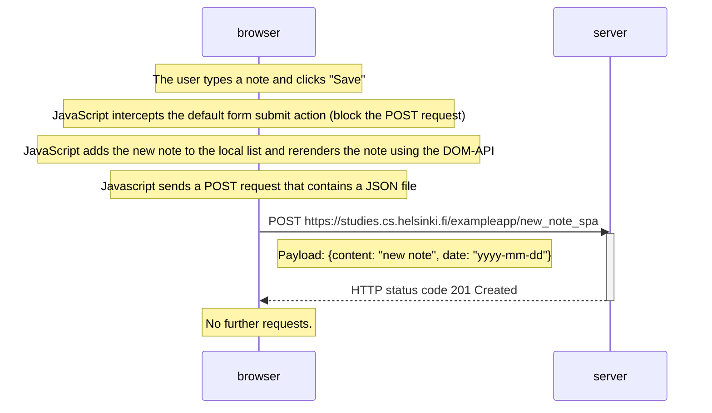

```mermaid
sequenceDiagram
    participant browser
    participant server

    Note over browser: The user types a note and clicks "Save"
    Note over browser: JavaScript intercepts the default form submit action (block the POST request)
    Note over browser: JavaScript adds the new note to the local list and rerenders the note using the DOM-API
    Note over browser: Javascript sends a POST request that contains a JSON file

    browser->>server: POST https://studies.cs.helsinki.fi/exampleapp/new_note_spa
    activate server
    Note right of browser: Payload: {content: "new note", date: "yyyy-mm-dd"}
    server-->>browser: HTTP status code 201 Created
    deactivate server

    Note over browser: No further requests.
```
